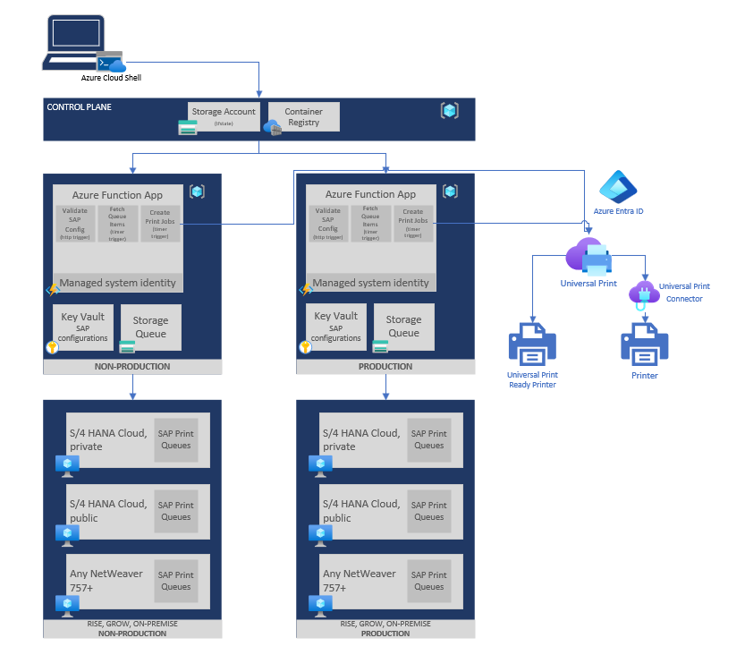
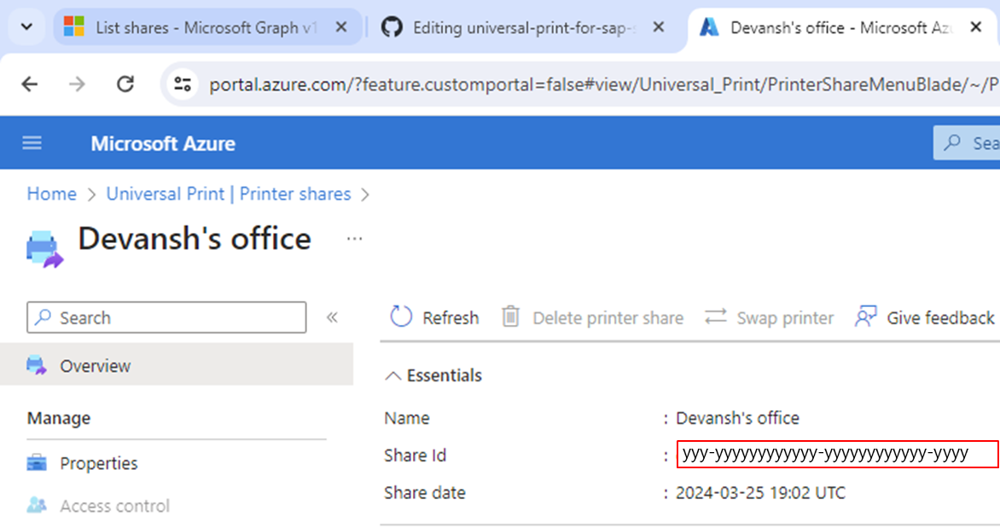
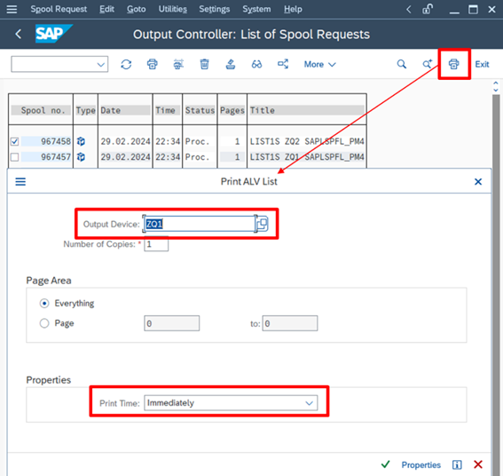
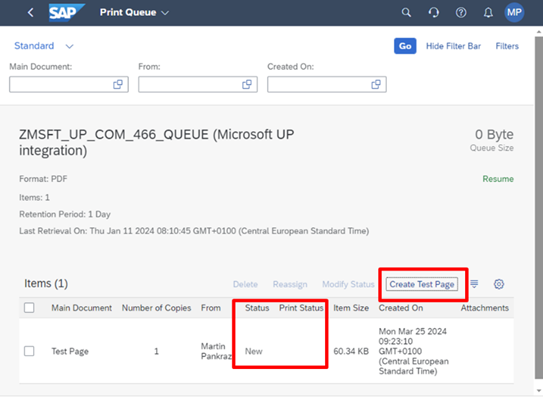

# Deployment Guide 🪂

**[🏠Home](README.md)**

This open-source solution interacts with the [SAP Print Queue](https://help.sap.com/docs/SAP_S4HANA_CLOUD/0f69f8fb28ac4bf48d2b57b9637e81fa/1e39bb68bbda4c48af4a79d35f5837e0.html) on the SAP backend via the SAP OData service [API_CLOUD_PRINT_PULL_SRV](https://api.sap.com/api/API_CLOUD_PRINT_PULL_SRV/overview) and dispatches the requests to Microsoft Universal Print managed printers via the [Microsoft Graph API](https://learn.microsoft.com/graph/api/resources/print?view=graph-rest-1.0).

This project is setup with [Terraform](https://www.terraform.io/) for automated provisioning.

## Pre-requisites📜

### Azure

- **Entra ID Tenant ID**
- **Azure Subscription ID**

### Microsoft Universal Print

- **Microsoft Universal Print License**: Learn More About Licensing and included free requests [here](https://learn.microsoft.com/en-us/universal-print/get-access-to-universal-print).
- **Registered Printers**: At least one physical printer registered in [Microsoft Universal Print](https://portal.azure.com/#view/Universal_Print/MainMenuBlade/~/Overview). Check the [Printer Registration Guide](https://learn.microsoft.com/en-us/universal-print/fundamentals/universal-print-printer-registration) for details.

### SAP System

- **SAP NetWeaver**: Minimum SAP_BASIS release 7.57 or above. This applies to S/4HANA 2022 or newer, and S/4HANA Cloud public edition.
- **SAP Print Queue Management**: Activate this feature in SAP by implementing the updates provided in [SAP Note](https://me.sap.com/notes/3348799) by applying the corrections in the note.
- **Authorized SAP User**: An individual empowered with the rights to generate and oversee spool requests and print queues, ensuring a smooth and secure printing process.

> [!NOTE]
> Consider implementing the SAP Cloud Print Manager to troubleshoot the SAP Print Queue component prior the integration with Universal Print to rule out any SAP internal configuration issues. SAP's Instructions are detailed in the attached PDF of [SAP Note](https://me.sap.com/notes/3420465). Don't forget to disable the Cloud Print Manager afterwards. Otherwise, it competes with your solution in grabbing print items ;-).

## Integration solution design 🏰
  


## Configure backend printing solution🛠️

The backend printing solution operates like a well-oiled machine, with two main components working in harmony:

1. **Deployment Infrastructure (Control Plane)**: Think of this as the conductor of an orchestra, overseeing the setup and ensuring that all parts of the printing process are perfectly tuned and ready for action.

2. **Backend Print Worker (Workload Plane)**: This is the musician of the group, diligently reading the music (spool requests) and playing the notes (sending print jobs) to the Universal Print devices with precision and care.

### Control Plane

The control plane is primarily responsible for managing the infrastructure state of the backend print worker and the Azure resources. The control plane is deployed using setup scripts and consists of the following components:

- **Persistent Storage**: A safe place for all Terraform state files, keeping track of your infrastructure’s blueprint.
- **Container Registry**: A digital library where the backend print worker’s image is stored, ready to be deployed.

### Workload Plane

The workload plane is where the action happens. It’s all about processing those print jobs, and it’s set up using Terraform. Here’s what it includes:

- **App Service Plan & Function App**: The stage where the backend print worker performs.
- **Application Insights**: An optional but keen observer for monitoring the backend print worker’s performance.
- **Key Vault**: A secure vault for all your secrets and sensitive information.
- **Storage Account**: The warehouse for managing print jobs.
- **Logic App & Custom Connector**: The messengers that ensure print jobs are delivered to Universal Print devices.
- **API Connection**: The bridge that connects the Logic App to the Universal Print API.
- **Managed Identity**: The backstage pass for the Function App, granting access to the Key Vault and Storage Account.

### Deploy the backend print solution

> [!NOTE]
> There are many ways to deploy the solution, among them local terraform installation, incorporation into your CI/CD pipeline etc. if you are familiar with them. However, this guide focusses on getting started with as few prerequisites as possible. For that reason the Azure Cloud Shell from within the Azure portal is being used. It ships an up to date terraform installation out of the box.

1. Open the [Azure Cloud Shell (Powershell)](https://portal.azure.com/#cloudshell/) from within the Azure portal.
2. Create a new file in the Cloud Shell editor. Copy and paste the below script into it and save it with ps1 extension (example: setup.ps1). Once you save the file, you can click the refresh button and find the file on the root. Open the file and, tweak the parameters (description below) so they fit your SAP environment. 

#### Script Parameters

| Name  | Description | Type | Example
| :--- | :------- | :--- | :--- |
| CONTROL_PLANE_ENVIRONMENT_CODE | Control Plane Environment Code is used to create unique names for control plane resources. | string | "CTRL", "MGMT" |
| WORKLOAD_ENVIRONMENT_CODE | Workload Environment Name is used to create unique names for workload resources | string | "PROD", "TEST', "DEV" |
| ENTRA_ID_TENANT_ID | Entra ID Tenant ID | string | "xxxxxxxx-xxxx-xxxx-xxxx-xxxxxxxxxxxx" |
| AZURE_SUBSCRIPTION_ID | Azure Subcription ID | string | "yyyyyyyy-yyyy-yyyy-yyyy-yyyyyyyyyyyy" |  
| SAP_VIRTUAL_NETWORK_ID | Resource ID of the Virtual Network where the SAP systems are deployed.  | string |
| BGPRINT_SUBNET_ADDRESS_PREFIX | Address prefix for the subnet where the backend printing service will be deployed | string | "10.10.10.10/25" |
| ENABLE_LOGGING_ON_FUNCTION_APP | Enable logging on the Azure Function App | bool string | "true"/"false" | 
| HOMEDRIVE | Drive for the azure user. This is the location you see when you are in the Azure Cloud Shell. Example: /home/john | string | "/home/john" |

```powershell
$Env:CONTROL_PLANE_ENVIRONMENT_CODE="CTRL"
$Env:WORKLOAD_ENVIRONMENT_CODE="TEST"
$Env:LOCATION=""
$Env:ENTRA_ID_TENANT_ID = ""
$Env:AZURE_SUBSCRIPTION_ID = ""
$Env:SAP_VIRTUAL_NETWORK_ID = ""
$Env:BGPRINT_SUBNET_ADDRESS_PREFIX = ""
$Env:ENABLE_LOGGING_ON_FUNCTION_APP = "false"
$Env:CONTAINER_REGISTRY_NAME = ""
$Env:HOMEDRIVE = ""

$UniqueIdentifier = Read-Host "Please provide an identifier that makes the service principal names unique, for example (MGMT/CTRL)"

$confirmation = Read-Host "Do you want to create a new Application registration for Control Plane y/n?"
if ($confirmation -eq 'y') {
    $Env:CONTROL_PLANE_SERVICE_PRINCIPAL_NAME = $UniqueIdentifier + "-SAP-PRINT-APP"
}
else {
    $Env:CONTROL_PLANE_SERVICE_PRINCIPAL_NAME = Read-Host "Please provide the Application registration name"
}

$ENV:SAPPRINT_PATH = Join-Path -Path $Env:HOMEDRIVE -ChildPath "SAP-PRINT"
if (-not (Test-Path -Path $ENV:SAPPRINT_PATH)) {
    New-Item -Path $ENV:SAPPRINT_PATH -Type Directory | Out-Null
}

Set-Location -Path $ENV:SAPPRINT_PATH

Get-ChildItem -Path $ENV:SAPPRINT_PATH -Recurse | Remove-Item -Force -Recurse

$scriptUrl = "https://raw.githubusercontent.com/Azure/universal-print-for-sap-starter-pack/main/deployer/scripts/install_backend_printing.ps1"
$scriptPath = Join-Path -Path $ENV:SAPPRINT_PATH -ChildPath "install_backend_printing.ps1"

Invoke-WebRequest -Uri $scriptUrl -OutFile $scriptPath

Invoke-Expression -Command $scriptPath
```

3. On powershell, execute the command using `./setup.ps1` command.

4. Once the script finishes, you’ll have both the control plane and the backend print worker neatly deployed in your Azure subscription.

<br>
<details><summary><strong>⤵️Naming convention followed for the resources deployed</strong></summary>

#### Control Plane Naming Convention

| Resource | Naming Convention |
| --- | --- |
| Resource Group Name | $CONTROL_PLANE_ENVIRONMENT_CODE-RG |
| Storage Account Name | $CONTROL_PLANE_ENVIRONMENT_CODEtstatebgprinting |
| Container Registry | sapprintacr |

#### Workload Plane Naming Convention

| Resource | Naming Convention |
| --- | --- |
| Resource Group Name | $WORKLOAD_ENVIRONMENT_CODE-$LOCATION-RG |
| App Server Plan | $WORKLOAD_ENVIRONMENT_CODE-$LOCATION-APPSERVICEPLAN |
| Function App | $WORKLOAD_ENVIRONMENT_CODE-$LOCATION-FUNCTIONAPP |
| Storage Account | $WORKLOAD_ENVIRONMENT_CODE$LOCATION$GUID |
| Key Vault | $WORKLOAD_ENVIRONMENT_CODE$LOCATIONKV |
| Logic App | $WORKLOAD_ENVIRONMENT_CODE$LOCATIONMSI |
| Logic App Custom Connector | $WORKLOAD_ENVIRONMENT_CODE$LOCATION-$GUID |
| API Connection | UPGRAPH-CONNECTION$GUID |

</details>
<br>

#### Authorize API connection to Universal Print

5. Jump to the workload plane resource group in the Azure portal.
6. Find the API connection resource and hit the "Edit API connection" button.
7. Click "Authorize" to link up with the Universal Print API. Once the pop-up window closes, remember to click the "Save" button to save the authorization connection.

#### Add SAP print queue configuration to the function app

8. Open the Function App and find the validator function on the overview screen.
9. Click on "Code + Test". Ready to connect the SAP?
10. Hit the "Test/Run" button.
11. In the body section, drop in the JSON payload provided below and press "Run". If you see a happy "200 OK" response code, you’re all set! If not, the error message will give you clues to fix any hiccups.
   
```json
{
    "sap_environment" : "PROD",
    "sap_sid": "SID",
    "sap_hostname": "http://10.186.102.6:8001",
    "sap_user": "sapuser",
    "sap_password": "sappassword",
    "sap_print_queues": [
        {
            "queue_name":"ZQ1",
            "print_share_id": "12345678-1234-1234-1234-123456789012"
        },
        {
            "queue_name":"ZQ2",
            "print_share_id": "12345678-1234-1234-1234-123456789012"
        }
    ]
}
```

Get the printer share id from the [Azure Portal](https://portal.azure.com/?#view/Universal_Print/MainMenuBlade/~/PrinterShares), via [Powershell](https://learn.microsoft.com/universal-print/fundamentals/universal-print-powershell), or the [Graph API](https://learn.microsoft.com/graph/api/print-list-shares?view=graph-rest-1.0&tabs=http). What ever suits you best.



See above a Screenshot from the portal experience to collect the id.

##### Function app parameters

| Name  | Description | Type | Example
| ------------- | ------------- | ------------- | ------------- |
| sap_environment | SAP landscape environment | string | "PROD" |
| sap_sid | SAP system identifier | string | "SID" |
| sap_hostname | Hostname or IP address of Web Dispatcher (recommended) or Primary Application Server with http protocol and port number | string | "http://fully.qualified.domainname:8001" |
| sap_user | SAP User with proper authorization | string | "USERNAME" |
| sap_password | Password for the SAP user  | string | "password" |
| sap_print_queues | List of print queue name and Universal Printer Share mapping. The printer share ID is on the overview blade of Universal Printer Share on Azure Portal. | list[map] | [{"queue_name":"ZQ1","print_share_id": "12345678-1234-1234-1234-123456789012"}

Add more queues or SAP environments by repeating the configuration steps above.

## Integration Test🧪

The simplest means for an integration test would be printing the ALV screen from transaction SP02. Find the print button and choose your new print queue as Output Device.



On S/4HANA Cloud tenants that ship Fiori apps or don’t offer SAPGUI access anymore use the app “Maintain Print Queues” and trigger “Create Test Page”.



## Ready, Set, Print🚀

You have more questions? Check out the [FAQ](FAQ.md) or reach out to us via [email](mailto:martin.pankraz@microsoft.com)
